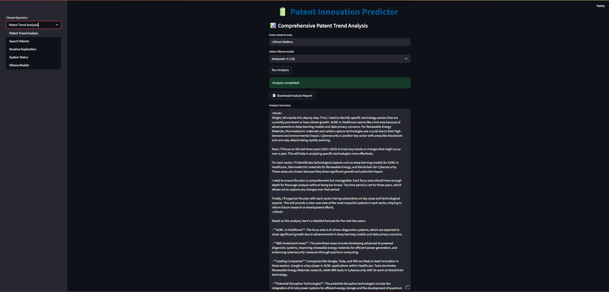

---

# 🔋 Patent Innovation Predictor

A cutting-edge AI-powered system that intelligently analyzes, explores, and forecasts innovation patterns in **patent datasets** across **diverse technology domains**. This project blends the strengths of **LLMs**, **vector databases**, **semantic search**, **SerpAPI**, and **multi-agent reasoning** into a unified tool that aids R\&D leaders, analysts, and strategists.

It provides both **CLI and GUI** interfaces to explore patent data, refine search results, generate insights, and forecast future trends.

---

## 🚀 Key Capabilities

* 🔍 **Keyword, Semantic & Hybrid Patent Search** using OpenSearch
* 🤖 **Multi-Agent Analysis** (CrewAI) for scoped, role-based patent forecasting
* 🔁 **Iterative Refinement** of search queries based on results
* 📈 **Trend Forecasting** to identify innovation hotspots and research gaps
* 🌐 **Streamlit Interface** for intuitive exploration and export
* 🔌 **SerpAPI Integration** for live patent updates and augmenting search results
* 📁 **Structured Outputs** in logs and reports folders for reproducibility
* 💻 **Dual Modes**: Command Line and GUI-based for maximum usability

---

## 🧰 Technology Stack

| Component      | Role & Importance                                                                      |
| -------------- | -------------------------------------------------------------------------------------- |
| **Python**     | Core programming language                                                              |
| **Ollama**     | Local LLM runtime for efficient, offline model execution                               |
| **LangChain**  | Chains prompts and manages context through modular pipelines                           |
| **CrewAI**     | Defines collaborative agents and task workflows                                        |
| **OpenSearch** | Search engine for hybrid (vector + keyword) querying over patent documents             |
| **Docker**     | Deploys OpenSearch reliably in isolated environments                                   |
| **Streamlit**  | Builds the interactive graphical dashboard                                             |
| **SerpAPI**    | Enables real-time enrichment from the web (e.g., fresh patent listings, market trends) |
| **.env**       | Secures sensitive environment variables like API keys                                  |

---

## 📁 Folder Structure

```
Patent_Predictor/
├── embeddings/                     # Embedding model configuration & logic
│   └── get_embedding.py
├── opensearch_client/              # OpenSearch connection wrapper
│   └── get_opensearch_client.py
├── outputs/
│   ├── logs/                       # LLM logs and agent diagnostics
│   └── patent_analysis/           # Generated reports and summaries
├── patent_search_tools.py         # Search logic: semantic, keyword, hybrid, iterative
├── patent_crew.py                 # Agent setup and forecasting pipeline using CrewAI
├── agentic_rag.py                 # CLI interface controller
├── app.py                         # Streamlit GUI application
├── requirements.txt               # Python dependencies
└── README.md                      # This file
```

---

## ⚙️ Setup Instructions

### ✅ Prerequisites

* Python 3.9+
* Docker (for OpenSearch)
* Ollama (to run LLMs locally)
* SerpAPI Key for live web enrichment

### 🧪 Installation

```bash
# Clone repository
$ git clone https://github.com/yourusername/Patent_Predictor.git
$ cd Patent_Predictor

# Setup Python environment
$ python -m venv venv
$ source venv/bin/activate  # or venv\Scripts\activate (Windows)

# Install Python packages
$ pip install -r requirements.txt
```

### 🧠 Ollama Setup (Local LLM)

```bash
# Start the Ollama server
$ ollama serve

# Pull a desired model (e.g. llama2, mistral)
$ ollama pull llama2:latest
```
---

## 🧪 CLI Interface

Run the CLI-based interactive menu:

```bash
$ python agentic_rag.py
```

---

### Available Options:

1. Run full patent forecasting pipeline
2. Search patents (Keyword, Semantic, Hybrid)
3. Perform multi-step refinement search
4. View Ollama system status
5. List locally available models
6. Exit

---

## 🌐 Streamlit UI

Launch the graphical interface:

```bash
$ streamlit run app.py
```

### Features:

* Choose **search type** (keyword, semantic, hybrid)
* Select **LLM model** from dynamic Ollama model list
* Input patent queries with result ranking
* Visual summary, PDF export, logs display
* Dynamic status panel with live feedback

---

## 🤖 Agentic Pipeline (CrewAI)

| Agent Role                | Responsibility                                               |
| ------------------------- | ------------------------------------------------------------ |
| **Research Director**     | Defines problem scope, time range, and tech objectives       |
| **Patent Retriever**      | Queries OpenSearch and external sources for relevant patents |
| **Patent Analyst**        | Detects trends, leading companies, innovation categories     |
| **Innovation Forecaster** | Predicts next-gen technologies, recommends R\&D directions   |

Each role is powered by a separate LLM instance and chained using `CrewAI` to simulate human-like task delegation and reasoning.

---

## 🔬 Core Functionalities

* 🔍 Unified **Hybrid Search**: combines keyword and vector queries
* ⛓️ **Multi-step Reasoning**: through sequential agent pipelines
* 📈 **Forecast Module**: predicts R\&D areas to watch or invest in
* 📡 **SerpAPI Integration**: optional fresh data fetching for better accuracy
* 🧠 **Offline LLM Inference**: runs via Ollama without cloud latency or API limits
* 💾 **Full traceability**: logs and agent traces are exportable for auditing

---

## 📬 Contact & Author

**Anish Tripathi**
🔹 AI/ML Developer | LLM Engineering | Semantic Search | Vector DBs | RAG Workflows
🔗 [GitHub](https://github.com/anish3565)
📧 [tripathianish12@gmail.com](mailto:tripathianish12@gmail.com)

---
